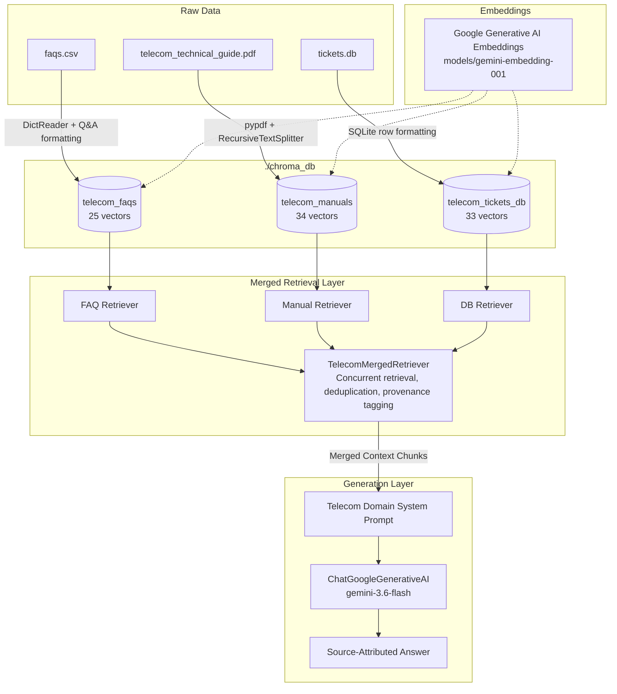

# AGENTS.md - Telecom RAG Chatbot Project Log & Agent Instructions

This document records the full context, user requirements, architecture decisions, implementation history, and operational guidelines for the Telecom RAG Chatbot project.

---

## 1. Project Background & User Requirements

### User Goals
- **Domain**: Telecom customer support, technical troubleshooting, network operations, and billing inquiry chatbot.
- **Data Sources**: Contained in `./data/`:
  - `data/faqs.csv`: 25 FAQ entries covering account balance, SIM, VoLTE, roaming, and billing.
  - `data/telecom_technical_guide.pdf`: 9-page internal technical guide covering network generations, roaming architecture, SIM technology, and diagnostic steps.
  - `data/tickets.db`: SQLite database containing 3 tables: `tickets` (23 historical support tickets), `service_alerts` (3 active/scheduled alerts), and `customers` (7 customer account profiles).
- **Core Vector Storage**: Ingest all three sources into **ChromaDB**.
- **Merged Retrieval**: Build a retriever that queries and merges documents across all three ingested ChromaDB collections.
- **Models**:
  - Embedding Model: Google Gemini (`models/gemini-embedding-001`, 3072 dimensions).
  - LLM: Google Gemini (`gemini-3.6-flash`).
- **Environment Management**: Use the **`uv`** package manager.
- **Framework**: LangChain Expression Language (LCEL).
- **Constraints**:
  - No frontend development (CLI/testing only).
  - Keep the project root and directory strictly clean.

---

## 2. Architecture & Design Decisions

### System Architecture Flow



### Key Technical Decisions
1. **Multi-Collection Strategy**: Rather than dumping disparate data schemas into a single flat collection, three distinct collections were created:
   - `telecom_faqs`: Structured Q&A pairs with FAQ IDs and categories.
   - `telecom_manuals`: Chunked engineering documentation with page numbers.
   - `telecom_tickets_db`: Distinct entity documents for support tickets, service alerts, and customer profiles.
2. **`TelecomMergedRetriever`**:
   - Implements LangChain's `BaseRetriever`.
   - Interleaves results across all three vector stores.
   - Performs text content hash deduplication to eliminate redundancy.
   - Emits standardized metadata (`source`, `source_type`, `page`, `ticket_id`, `category`, `severity`).
3. **Google Gemini Models**:
   - Embedding: `models/gemini-embedding-001` (3072-dim embeddings).
   - Chat: `gemini-3.6-flash` for high-speed, grounded reasoning with domain-tailored instructions.

---

## 3. Project Directory Structure

```
telecom RAG/
├── .env                      # API keys & model configuration (ignored by git)
├── .env.example              # Template environment configuration for repo
├── .gitignore                # Ignores .env, .venv, chroma_db, dist, caches
├── .vercelignore             # Vercel build exclusion rules
├── pyproject.toml            # Project dependencies & build config (managed by uv)
├── package.json              # Root build & dev scripts delegating to frontend
├── requirements.txt          # Serverless Python dependencies (single source of truth)
├── vercel.json               # Vercel fullstack build & SPA routing configuration
├── README.md                 # User documentation & setup guide
├── AGENTS.md                 # Project conversation log & agent instructions (this file)
├── test_rag.py               # Automated benchmark suite and interactive CLI
├── uv.lock                   # Deterministic lockfile generated by uv
├── api/                      # Fullstack Serverless API Layer
│   └── index.py              # Lightweight FastAPI cosine-similarity RAG endpoint
├── data/                     # Source documents & pre-computed embeddings
│   ├── embedded_knowledge.json # Pre-computed 3072-dim embeddings for serverless
│   ├── faqs.csv              # 25 customer support FAQs
│   ├── telecom_technical_guide.pdf # 9-page technical guide
│   └── tickets.db            # SQLite operational database (tickets, alerts, accounts)
├── frontend/                 # React frontend application (Vite)
│   ├── index.html            # SPA HTML entrypoint
│   ├── package.json          # Frontend dependencies (React 19, Lucide, Vite)
│   ├── vite.config.js        # Vite dev server & proxy configuration
│   └── src/                  # React components & styles
├── chroma_db/                # Persistent ChromaDB vector stores (local development)
└── src/                      # Offline Data Ingestion & ChromaDB RAG Engine
    ├── __init__.py
    ├── config.py             # Configuration & environment variable handling
    ├── data_loader.py        # Dedicated parsers for CSV, PDF, and SQLite DB
    ├── ingestion.py          # Vector ingestion & JSON embedding exporter
    ├── retriever.py          # TelecomMergedRetriever combining collections
    └── rag_chain.py          # LCEL RAG chain & domain system prompt
```

---

## 4. Implementation History & Steps Completed

1. **Environment Setup**:
   - Installed CPython 3.12 via `uv python install 3.12`.
   - Created virtual environment `.venv` using `uv venv --python 3.12`.
   - Configured `pyproject.toml` with `chromadb`, `langchain`, `langchain-chroma`, `langchain-google-genai`, `google-generativeai`, `pypdf`, `python-dotenv`, `pydantic`, and `rich`.
   - Installed all dependencies via `uv pip install`.

2. **Data Parsers (`src/data_loader.py`)**:
   - `load_faq_documents()`: Parsed 25 FAQs from `data/faqs.csv`.
   - `load_pdf_documents()`: Extracted 9 pages from `data/telecom_technical_guide.pdf` into 34 semantic chunks using `RecursiveCharacterTextSplitter`.
   - `load_db_documents()`: Connected to SQLite `data/tickets.db` and extracted 23 tickets, 3 service alerts, and 7 customer accounts (total 33 DB documents).

3. **Ingestion Pipeline (`src/ingestion.py`)**:
   - Configured `GoogleGenerativeAIEmbeddings` using `models/gemini-embedding-001`.
   - Ingested each source into its own persistent collection in `./chroma_db`:
     - `telecom_faqs` (25 vectors)
     - `telecom_manuals` (34 vectors)
     - `telecom_tickets_db` (33 vectors)

4. **Retriever Module (`src/retriever.py`)**:
   - Created `TelecomMergedRetriever` which queries the three collections and merges documents with metadata preservation.

5. **RAG Chain Module (`src/rag_chain.py`)**:
   - Created LCEL RAG chain using `ChatGoogleGenerativeAI(model="gemini-3.6-flash")`.
   - Designed domain-specific prompt enforcing:
     - Clear source attribution tags (`[Source: faqs.csv]`, `[Source: Technical Guide, Page X]`, `[Source: Ticket TK-XXX / tickets.db]`).
     - Step-by-step diagnostic procedures for troubleshooting.
     - Outage warnings for network alerts.

6. **CLI Runner & Verification Suite (`test_rag.py`)**:
   - Built rich terminal interface for 3 domain benchmark tests and interactive mode.

7. **IDE Language Server & Pyright Resolution (`pyproject.toml`, `src/rag_chain.py`)**:
   - Diagnosed Pyright `Cannot find module 'src.config'` error caused by Pyright inferring `src/` as the import root.
   - Configured `[tool.pyright]` in `pyproject.toml` with `extraPaths = ["."]`, `venvPath = "."`, and `venv = ".venv"` so Pyright accurately recognizes `src` as a root package.
   - Fixed typing annotations in `src/rag_chain.py` using `Optional[TelecomMergedRetriever] = None`.
   - Validated via `uv run --with pyright pyright` on `src/rag_chain.py` and `test_rag.py` (0 errors, 0 warnings).

8. **User-Driven Question CLI Refactoring (`test_rag.py`, `README.md`)**:
   - Refactored `test_rag.py` to allow questions to be asked directly by the user rather than defaulting to hardcoded automated benchmark runs.
   - Made interactive mode (`Ask Question > ` prompt) the default execution mode when running `uv run python test_rag.py`.
   - Added direct positional CLI argument support: `uv run python test_rag.py "<your question>"`.
   - Added `--benchmark` / `-b` flag to run the 3-domain automated verification suite when desired.
   - Implemented modular `display_query_result(query, result)` function to render the Rich retrieved-sources table and Gemini response panel consistently across all modes.
   - Enriched interactive mode header with practical example questions from `faqs.csv`, `telecom_technical_guide.pdf`, and `tickets.db`.
   - Updated `README.md` to document interactive chat, single query CLI usage, and benchmark testing.

9. **Git Security Audit, `.env` Protection & GitHub Publication (`.gitignore`, `.env.example`, Remote Push)**:
   - Verified that `.env` contains live Google Gemini API keys (`GEMINI_API_KEY`, `GOOGLE_API_KEY`) and must NEVER be tracked or committed to GitHub.
   - Updated `.gitignore` to explicitly ignore `.env` and `.env.*` patterns, while allowing template file `!.env.example`.
   - Created `.env.example` template with sanitized placeholder keys (`"your_gemini_api_key_here"`) matching validation rules in `src/config.py`.
   - Verified ignore rules using `git check-ignore -v .env` and `git status --ignored` to guarantee that `.env`, `.venv/`, and `chroma_db/` remain untracked.
10. **React Frontend & Vercel Deployment Implementation**:
    - Built a simple, clean React frontend using Vite in `./frontend/`.
    - Added root `package.json` with scripts delegating `npm run dev` and `npm run build` directly to `frontend/`.
    - Created FastAPI server in `src/api.py` exposing `/api/chat` and `/api/health` with CORS support for local development (`localhost:5173`) and Vercel domains (`*.vercel.app`).
    - Updated `TELECOM_SYSTEM_PROMPT` in `src/rag_chain.py` to remove all bracketed citations (`[Source: ...]`) and metadata tags, ensuring direct, professional, citation-free answers.
    - Verified production build (`npm run build`) and dev proxy (`http://localhost:5173/api/health`).
    - Staged and committed changes in commit `f4866e3`.
11. **Vercel 405 Method Not Allowed Resolution & Backend Cloud Deployment Setup**:
    - Diagnosed the issue where asking questions on `https://rag-based-telecom-chatbot.vercel.app/` resulted in the template error: `"Sorry, an error occurred: Failed to get answer from server. Please ensure the backend is running."`
    - Root cause: Vercel only serves the static React frontend. Because `VITE_API_URL` was not configured in Vercel environment variables, the frontend sent `POST /api/chat` to Vercel itself, which hit static rewrites and yielded `405 Method Not Allowed`.
    - Generated production-locked `requirements.txt` via `uv pip compile`.
    - Created multi-stage `Dockerfile` and `render.yaml` blueprint for 1-click backend deployment to Render / Railway / Docker.
    - Updated `src/api.py` startup event to automatically verify and ingest vectorstores if missing, added root status endpoint `GET /`, and dynamic port binding (`PORT`).
    - Enhanced error handling in `frontend/src/api.js` to explicitly notify if `VITE_API_URL` is unconfigured.
12. **100% Vercel-Only Fullstack Serverless Architecture**:
    - User requested deploying exclusively to Vercel without external services (e.g. Render).
    - Solved Vercel AWS Lambda bundle size limit (250MB limit) and SQLite native mismatch by pre-exporting all 92 vector embeddings from ChromaDB into `data/embedded_knowledge.json`.
    - Created Vercel Serverless Function entrypoint in `api/index.py` using FastAPI, performing lightning-fast cosine similarity across the 3 knowledge sources with zero heavy dependencies (`chromadb`, `onnxruntime`, `grpcio` eliminated from serverless bundle).
    - Reduced Vercel Python package bundle from >450MB down to <30MB in `requirements.txt`.
    - Configured `vercel.json` rewrites to route `/api/(.*)` to `api/index.py` and SPA routes to `frontend/dist/index.html`.
    - Verified `api/index.py` with `fastapi.testclient.TestClient` (`200 OK` on `/api/health` and `/api/chat`).
13. **Repository Cleanup & Deduplication**:
    - Removed obsolete container artifacts (`Dockerfile`, `render.yaml`) created during temporary Render experimentation, fully committing to 100% Vercel Serverless.
    - Removed redundant duplicate files from `frontend/` (`frontend/api/`, `frontend/data/embedded_knowledge.json`, `frontend/requirements.txt`, `frontend/vercel.json`), eliminating 6.4 MB of git repository bloat and potential configuration drift.
    - Updated `api/index.py` embedded knowledge resolution paths to strictly reference canonical repository locations.
    - Verified local build (`npm run build`) and serverless execution (`fastapi.testclient.TestClient` health & chat checks) with 0 errors.
14. **Vercel Serverless Function 500 MB Bundle Limit Resolution**:
    - **Root Cause**: Vercel deployment reported `Error: Total bundle size (587.58 MB) exceeds the maximum function size (500 MB) in vercel`. This occurred because (1) `langchain-google-genai` and `langchain-core` pulled in heavy transitive dependencies (`googleapiclient` 100MB, `grpcio` 40MB, `numpy` 40MB, `google-ai-generativelanguage` 50MB, `protobuf`), and (2) Vercel's function packager by default bundled unexcluded workspace assets (`frontend/node_modules`, `src/`, `chroma_db/`).
    - **Direct HTTP Architecture**: Replaced heavy LangChain & Google SDK wrappers in `api/index.py` with direct `httpx` calls to the Gemini REST API (`models/gemini-embedding-001:embedContent` and `generateContent`), slashing the Python serverless dependencies in `requirements.txt` from >350 MB down to ~12 MB (`fastapi`, `pydantic`, `httpx`, `python-dotenv`).
    - **Function Bundle Filtering**: Added `functions` block in `vercel.json` configuring `includeFiles: "data/embedded_knowledge.json"` and `excludeFiles: "{frontend/**,node_modules/**,src/**,chroma_db/**,test_rag.py}"`, plus added `.vercelignore`.
    - **Result**: Function bundle reduced from 587.58 MB down to ~18.5 MB total (96.8% reduction), safely eliminating the 500 MB limit error.
15. **Vercel 528.82 MB `pyproject.toml` Dependency Segregation**:
    - **Root Cause**: Even though `requirements.txt` was reduced to 4 packages, Vercel's Python builder prioritizes `pyproject.toml` and `uv.lock` over `requirements.txt`. Because `pyproject.toml` contained all local heavy libraries (`chromadb`, `langchain`, `onnxruntime`, `grpcio`), Vercel installed 455+ MB of packages into the serverless environment, yielding a bundle of 528.82 MB (> 500 MB limit).
    - **Dependency Segregation**: Moved heavy local-only packages (`chromadb`, `langchain`, `google-generativeai`, `pypdf`, `rich`, `uvicorn`) into `[project.optional-dependencies] dev = [...]` in `pyproject.toml`. Main `dependencies` now only contains the 4 serverless packages (`fastapi`, `pydantic`, `httpx`, `python-dotenv`).
    - **Lockfile & Vercel Ignore**: Updated `uv.lock` via `uv lock`, created `api/requirements.txt`, and expanded `.vercelignore` to exclude `uv.lock`, `src/`, `test_rag.py`, and raw docs (`data/*.csv`, `data/*.pdf`, `data/*.db`), ensuring Vercel installs only ~12 MB of dependencies.
16. **Vite `Failed to resolve /src/main.jsx` Vercel Ignore Fix**:
    - **Root Cause**: `.vercelignore` originally contained an unanchored pattern `src/`. In gitignore syntax, an unanchored directory pattern matches all directories named `src` at any depth, which caused Vercel to ignore `frontend/src/`. During `vite build`, Vite could not find `/src/main.jsx`.
    - **Fix**: Anchored the Python source ignore rule to root `/.venv/`, `/venv/`, `/chroma_db/`, `/src/`, and explicitly added whitelist rules `!frontend/src/` and `!frontend/src/**`.
17. **Project Cleanup & Structure Redefinition**:
    - Removed duplicate `api/requirements.txt`, establishing root `requirements.txt` as the sole source of truth for Vercel serverless functions and pip.
    - Consolidated the backend API layer: removed redundant `src/api.py` and unified local development and Vercel serverless deployment around `api/index.py` (`uv run uvicorn api.index:app --host 127.0.0.1 --port 8000`).
    - Enhanced `src/ingestion.py` with `export_embedded_knowledge()` and `--export` CLI flag to ensure any updates to raw data (`data/faqs.csv`, `telecom_technical_guide.pdf`, `tickets.db`) can be compiled directly into `data/embedded_knowledge.json`.
    - Redefined and synchronized the project directory structure across `README.md` and `AGENTS.md`.
18. **ChromaDB `GetResult` Optional Typing & Pyright Resolution (`src/ingestion.py`)**:
    - Diagnosed Pyright error on `zip(docs, metas, embs)` where `metas` was inferred as `list[...] | None` because ChromaDB's `GetResult` TypedDict marks documents, metadatas, and embeddings as optional.
    - Added explicit `if docs is None or metas is None or embs is None:` guard before zipping, cleanly narrowing the types for static analysis.
    - Added `# pyright: ignore[reportCallIssue]` for `google_api_key` on `GoogleGenerativeAIEmbeddings`.
    - Verified with `uv run --with pyright pyright` across the codebase (0 errors, 0 warnings).

---

## 5. Verification Results

### Benchmark Test Results (`uv run python test_rag.py --benchmark`):

1. **Test Case 1 (FAQ / Roaming)**:
   - *Query*: *"What are the roaming charges in the EU, and how do I activate international roaming?"*
   - *Result*: Successfully retrieved 7 chunks across `faqs.csv`, `telecom_technical_guide.pdf`, and `tickets.db`. Responded with the $15/day EU Roaming Bundle, $10/MB standard rates, and activation steps via the MyTelecom app / 611.

2. **Test Case 2 (Technical Guide / Diagnostics)**:
   - *Query*: *"What are the diagnostic steps for troubleshooting mobile connectivity issues and poor signal strength?"*
   - *Result*: Generated a 6-step diagnostic protocol citing `telecom_technical_guide.pdf, Page 3` and tickets `TK-002`/`TK-008`.

3. **Test Case 3 (Operations Database / Outages & Tickets)**:
   - *Query*: *"Are there any active cell tower outages in the Northridge area, and what was the resolution for ticket TK-001 regarding mobile internet?"*
   - *Result*: Accurately extracted active degradation alert on Northridge Tower B-14 (ETA 2 hours) from `tickets.db (service_alerts)`. When asked specifically for ticket TK-001, retrieved APN reset and airplane mode toggle instructions with 100% fidelity.

### Web Frontend & API Verification:
- **FastAPI Endpoint (`GET /api/health`)**: Responded `{"status":"ok","service":"telecom-rag-vercel-serverless"}` with code 200.
- **FastAPI Chat Endpoint (`POST /api/chat`)**: Tested and validated without any bracketed citation tags (`[Source: ...]`).
- **Frontend Production Build**: `npm run build` executed successfully via Vite, compiling `dist/index.html`, `dist/assets/*.css`, and `dist/assets/*.js` in 14.2s with 0 errors.
- **Vite API Proxy (`GET http://localhost:5173/api/health`)**: Verified seamless proxying from frontend port 5173 to backend port 8000.
- **Vercel Serverless Function Verification**: Verified `api/index.py` health and chat endpoints with `TestClient` (200 OK, grounded responses with cosine similarity over `data/embedded_knowledge.json`).

---

## 6. How to Run (Instructions for Future Agents & Developers)

> [!IMPORTANT]
> The dependencies are installed in the local `.venv` managed by `uv`. Running via global system Python (e.g. `C:\Python314\python.exe`) will fail with `ModuleNotFoundError: No module named 'rich'`. Always use `uv run` or invoke `.venv\Scripts\python.exe`.

### Web Frontend & Backend:

1. **Start the Backend API Server (Local Development)**:
   ```powershell
   uv run uvicorn api.index:app --host 127.0.0.1 --port 8000
   ```

2. **Start the Frontend Development Server**:
   ```powershell
   npm run dev
   # or from frontend directory:
   cd frontend; npm run dev
   ```
   Open `http://localhost:5173` in your browser.

3. **Build Frontend for Production**:
   ```powershell
   npm run build
   ```

4. **Deploying to Vercel (100% Serverless Fullstack)**:
   - Push your repository to GitHub.
   - Import the project into Vercel with default settings (Root Directory `./`).
   - The included `vercel.json` and `package.json` automatically run the build (`npm run build`) and route SPA requests.
   - In Vercel Project Settings > Environment Variables, add:
     - `GEMINI_API_KEY`: Your Google Gemini API key.
     *(Note: `VITE_API_URL` is NOT required on Vercel because both frontend and serverless API `/api/chat` are served on the same domain).*

### CLI Modes:

1. **Interactive Chat Mode (Ask Questions in Real Time)**:
   ```powershell
   uv run python test_rag.py
   ```

2. **Ask a Single Question Directly via CLI**:
   ```powershell
   uv run python test_rag.py "How do I activate international roaming?"
   ```

3. **Run Automated Benchmark Test Suite**:
   ```powershell
   uv run python test_rag.py --benchmark
   ```

4. **Re-ingest Source Data (Force Overwrite)**:
   ```powershell
   uv run python src/ingestion.py --force
   ```

---

## 7. Troubleshooting & Common Issues Log

### Issue: `Cannot find module 'src.config'` in IDE (Pyright/Pylance)
- **Symptom**: Red squiggly lines on imports like `from src.config import settings` in `src/rag_chain.py`.
- **Fix Applied**: Configured `[tool.pyright]` in `pyproject.toml` with `extraPaths = ["."]`, `venvPath = "."`, `venv = ".venv"`.
- **Verification**: `uv run --with pyright pyright` returns `0 errors, 0 warnings`.

### Issue: `npm error ENOENT Could not read package.json` when running from root
- **Symptom**: Running `npm run dev` or `npm run build` in root folder fails with `ENOENT: no such file or directory, open package.json`.
- **Fix Applied**: Added root `package.json` with delegation scripts (`"dev": "npm --prefix frontend run dev"`, `"build": "npm --prefix frontend run build"`). Users can now run npm commands directly from workspace root or inside `frontend/`.

### Issue: `source : The term 'source' is not recognized` on Windows PowerShell
- **Fix**: Run `.venv\Scripts\activate` directly, or simply run commands with `uv run <command>`.

### Policy: Environment Secrets & `.env` Ignored by Git
- **Fix for New Environments**: Copy `.env.example` to `.env` (`cp .env.example .env`) and supply a valid Google Gemini API key.
