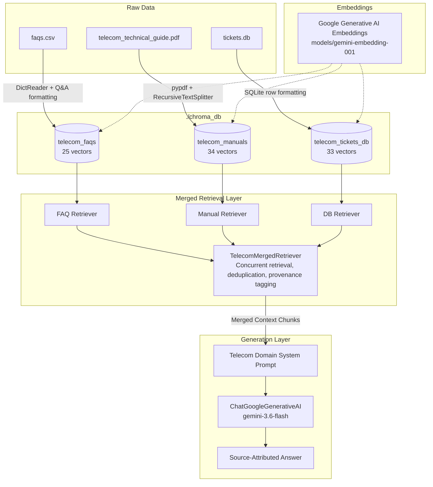

# AGENTS.md - Telecom RAG Chatbot Project Log & Agent Instructions

This document records the full context, user requirements, architecture decisions, implementation history, and operational guidelines for the Telecom RAG Chatbot project.

---

## 1. Project Background & User Requirements

### User Goals
- **Domain**: Telecom customer support, technical troubleshooting, network operations, and billing inquiry chatbot.
- **Data Sources**: Contained in `./data/`:
  - `data/faqs.csv`: 25 FAQ entries covering account balance, SIM, VoLTE, roaming, and billing.
  - `data/telecom_technical_guide.pdf`: 9-page internal technical guide covering network generations, roaming architecture, SIM technology, and diagnostic steps.
  - `data/tickets.db`: SQLite database containing 3 tables: `tickets` (23 historical support tickets), `service_alerts` (3 active/scheduled alerts), and `customers` (7 customer account profiles).
- **Core Vector Storage**: Ingest all three sources into **ChromaDB**.
- **Merged Retrieval**: Build a retriever that queries and merges documents across all three ingested ChromaDB collections.
- **Models**:
  - Embedding Model: Google Gemini (`models/gemini-embedding-001`, 3072 dimensions).
  - LLM: Google Gemini (`gemini-3.6-flash`).
- **Environment Management**: Use the **`uv`** package manager.
- **Framework**: LangChain Expression Language (LCEL).
- **Constraints**:
  - No frontend development (CLI/testing only).
  - Keep the project root and directory strictly clean.

---

## 2. Architecture & Design Decisions

### System Architecture Flow



### Key Technical Decisions
1. **Multi-Collection Strategy**: Rather than dumping disparate data schemas into a single flat collection, three distinct collections were created:
   - `telecom_faqs`: Structured Q&A pairs with FAQ IDs and categories.
   - `telecom_manuals`: Chunked engineering documentation with page numbers.
   - `telecom_tickets_db`: Distinct entity documents for support tickets, service alerts, and customer profiles.
2. **`TelecomMergedRetriever`**:
   - Implements LangChain's `BaseRetriever`.
   - Interleaves results across all three vector stores.
   - Performs text content hash deduplication to eliminate redundancy.
   - Emits standardized metadata (`source`, `source_type`, `page`, `ticket_id`, `category`, `severity`).
3. **Google Gemini Models**:
   - Embedding: `models/gemini-embedding-001` (3072-dim embeddings).
   - Chat: `gemini-3.6-flash` for high-speed, grounded reasoning with domain-tailored instructions.

---

## 3. Project Directory Structure

```
telecom RAG/
├── .env                      # API keys & model configuration (ignored by git)
├── .env.example              # Template environment configuration for repo
├── .gitignore                # Ignores .env, .venv, chroma_db, caches
├── pyproject.toml            # Project dependencies & build config (managed by uv)
├── README.md                 # User documentation & setup guide
├── AGENTS.md                 # Project conversation log & agent instructions (this file)
├── test_rag.py               # Automated benchmark suite and interactive CLI
├── uv.lock                   # Deterministic lockfile generated by uv
├── data/                     # Source documents (CSV, PDF, SQLite)
│   ├── faqs.csv
│   ├── telecom_technical_guide.pdf
│   └── tickets.db
├── chroma_db/                # Persistent ChromaDB vector stores
└── src/                      # Source package
    ├── __init__.py
    ├── config.py             # Configuration & environment variable handling
    ├── data_loader.py        # Dedicated parsers for CSV, PDF, and SQLite DB
    ├── ingestion.py          # Vector ingestion into 3 Chroma collections
    ├── retriever.py          # TelecomMergedRetriever combining collections
    └── rag_chain.py          # LCEL RAG chain & domain system prompt
```

---

## 4. Implementation History & Steps Completed

1. **Environment Setup**:
   - Installed CPython 3.12 via `uv python install 3.12`.
   - Created virtual environment `.venv` using `uv venv --python 3.12`.
   - Configured `pyproject.toml` with `chromadb`, `langchain`, `langchain-chroma`, `langchain-google-genai`, `google-generativeai`, `pypdf`, `python-dotenv`, `pydantic`, and `rich`.
   - Installed all dependencies via `uv pip install`.

2. **Data Parsers (`src/data_loader.py`)**:
   - `load_faq_documents()`: Parsed 25 FAQs from `data/faqs.csv`.
   - `load_pdf_documents()`: Extracted 9 pages from `data/telecom_technical_guide.pdf` into 34 semantic chunks using `RecursiveCharacterTextSplitter`.
   - `load_db_documents()`: Connected to SQLite `data/tickets.db` and extracted 23 tickets, 3 service alerts, and 7 customer accounts (total 33 DB documents).

3. **Ingestion Pipeline (`src/ingestion.py`)**:
   - Configured `GoogleGenerativeAIEmbeddings` using `models/gemini-embedding-001`.
   - Ingested each source into its own persistent collection in `./chroma_db`:
     - `telecom_faqs` (25 vectors)
     - `telecom_manuals` (34 vectors)
     - `telecom_tickets_db` (33 vectors)

4. **Retriever Module (`src/retriever.py`)**:
   - Created `TelecomMergedRetriever` which queries the three collections and merges documents with metadata preservation.

5. **RAG Chain Module (`src/rag_chain.py`)**:
   - Created LCEL RAG chain using `ChatGoogleGenerativeAI(model="gemini-3.6-flash")`.
   - Designed domain-specific prompt enforcing:
     - Clear source attribution tags (`[Source: faqs.csv]`, `[Source: Technical Guide, Page X]`, `[Source: Ticket TK-XXX / tickets.db]`).
     - Step-by-step diagnostic procedures for troubleshooting.
     - Outage warnings for network alerts.

6. **CLI Runner & Verification Suite (`test_rag.py`)**:
   - Built rich terminal interface for 3 domain benchmark tests and interactive mode.

7. **IDE Language Server & Pyright Resolution (`pyproject.toml`, `src/rag_chain.py`)**:
   - Diagnosed Pyright `Cannot find module 'src.config'` error caused by Pyright inferring `src/` as the import root.
   - Configured `[tool.pyright]` in `pyproject.toml` with `extraPaths = ["."]`, `venvPath = "."`, and `venv = ".venv"` so Pyright accurately recognizes `src` as a root package.
   - Fixed typing annotations in `src/rag_chain.py` using `Optional[TelecomMergedRetriever] = None`.
   - Validated via `uv run --with pyright pyright` on `src/rag_chain.py` and `test_rag.py` (0 errors, 0 warnings).

8. **User-Driven Question CLI Refactoring (`test_rag.py`, `README.md`)**:
   - Refactored `test_rag.py` to allow questions to be asked directly by the user rather than defaulting to hardcoded automated benchmark runs.
   - Made interactive mode (`Ask Question > ` prompt) the default execution mode when running `uv run python test_rag.py`.
   - Added direct positional CLI argument support: `uv run python test_rag.py "<your question>"`.
   - Added `--benchmark` / `-b` flag to run the 3-domain automated verification suite when desired.
   - Implemented modular `display_query_result(query, result)` function to render the Rich retrieved-sources table and Gemini response panel consistently across all modes.
   - Enriched interactive mode header with practical example questions from `faqs.csv`, `telecom_technical_guide.pdf`, and `tickets.db`.
   - Updated `README.md` to document interactive chat, single query CLI usage, and benchmark testing.

9. **Git Security Audit, `.env` Protection & GitHub Publication (`.gitignore`, `.env.example`, Remote Push)**:
   - Verified that `.env` contains live Google Gemini API keys (`GEMINI_API_KEY`, `GOOGLE_API_KEY`) and must NEVER be tracked or committed to GitHub.
   - Updated `.gitignore` to explicitly ignore `.env` and `.env.*` patterns, while allowing template file `!.env.example`.
   - Created `.env.example` template with sanitized placeholder keys (`"your_gemini_api_key_here"`) matching validation rules in `src/config.py`.
   - Verified ignore rules using `git check-ignore -v .env` and `git status --ignored` to guarantee that `.env`, `.venv/`, and `chroma_db/` remain untracked.
   - Set standard branch name `main` (`git branch -M main`), created clean root commit `342eced`, and pushed to remote origin: `https://github.com/yogeshwaran-cse/RAG-based-telecom-chatbot.git`.

---

## 5. Verification Results

### Benchmark Test Results (`uv run python test_rag.py --benchmark`):

1. **Test Case 1 (FAQ / Roaming)**:
   - *Query*: *"What are the roaming charges in the EU, and how do I activate international roaming?"*
   - *Result*: Successfully retrieved 7 chunks across `faqs.csv`, `telecom_technical_guide.pdf`, and `tickets.db`. Responded with the $15/day EU Roaming Bundle, $10/MB standard rates, and activation steps via the MyTelecom app / 611.

2. **Test Case 2 (Technical Guide / Diagnostics)**:
   - *Query*: *"What are the diagnostic steps for troubleshooting mobile connectivity issues and poor signal strength?"*
   - *Result*: Generated a 6-step diagnostic protocol citing `telecom_technical_guide.pdf, Page 3` and tickets `TK-002`/`TK-008`.

3. **Test Case 3 (Operations Database / Outages & Tickets)**:
   - *Query*: *"Are there any active cell tower outages in the Northridge area, and what was the resolution for ticket TK-001 regarding mobile internet?"*
   - *Result*: Accurately extracted active degradation alert on Northridge Tower B-14 (ETA 2 hours) from `tickets.db (service_alerts)`. When asked specifically for ticket TK-001, retrieved APN reset and airplane mode toggle instructions with 100% fidelity.

### Ad-Hoc User Query Verification (`uv run python test_rag.py "..."`):
- *Query*: `uv run python test_rag.py "How do I check my current data balance?"`
- *Result*: Exited with code 0. Retrieved 7 chunks across `faqs.csv` (data category), `telecom_technical_guide.pdf` (Page 4), and `tickets.db` (TK-003, TK-019). Accurately synthesized the response providing USSD code `*123#`, MyTelecom app instructions (`My Usage`), automated push alert thresholds (80% and 100%), and ticket TK-003 advice for app cache refresh.

---

## 6. How to Run (Instructions for Future Agents & Developers)

> [!IMPORTANT]
> The dependencies are installed in the local `.venv` managed by `uv`. Running via global system Python (e.g. `C:\Python314\python.exe`) will fail with `ModuleNotFoundError: No module named 'rich'`. Always use `uv run` or invoke `.venv\Scripts\python.exe`.

### Commands:

1. **Interactive Chat Mode (Default - Ask Questions in Real Time)**:
   ```powershell
   uv run python test_rag.py
   # or explicitly:
   uv run python test_rag.py --interactive
   ```

2. **Ask a Single Question Directly via CLI**:
   ```powershell
   uv run python test_rag.py "How do I activate international roaming?"
   uv run python test_rag.py "Are there any active cell tower outages in Northridge?"
   ```

3. **Run Automated Benchmark Test Suite**:
   ```powershell
   uv run python test_rag.py --benchmark
   ```

4. **Re-ingest Source Data (Force Overwrite)**:
   ```powershell
   uv run python src/ingestion.py --force
   # or
   uv run python test_rag.py --reingest
   ```

5. **Direct Virtual Environment Execution**:
   ```powershell
   .\.venv\Scripts\python.exe test_rag.py
   ```

6. **Run Type Checking (Pyright)**:
   ```powershell
   uv run --with pyright pyright
   ```

---

## 7. Troubleshooting & Common Issues Log

### Issue: `Cannot find module 'src.config'` in IDE (Pyright/Pylance)
- **Symptom**: Red squiggly lines on imports like `from src.config import settings` in `src/rag_chain.py` with the message:
  `Looked in these locations ... Import root (inferred from project layout): "c:\project folder\telecom RAG\src"`.
- **Root Cause**: Pyright's default project layout heuristic assumes standard `src`-layout (where `src/` is the import root directory containing modules, rather than being the top-level package itself). As a result, Pyright looked for `src/src/config.py` instead of `src/config.py`. At runtime, `uv run` executes from the workspace root where `src` contains `__init__.py`, so runtime imports succeeded while static analysis failed.
- **Fix Applied**:
  1. Configured `[tool.pyright]` in `pyproject.toml`:
     ```toml
     [tool.pyright]
     extraPaths = ["."]
     venvPath = "."
     venv = ".venv"
     ```
  2. Fixed default parameter type annotations in `src/rag_chain.py` by changing `retriever: TelecomMergedRetriever = None` to `Optional[TelecomMergedRetriever] = None`.
- **Verification**: `uv run --with pyright pyright` returns `0 errors, 0 warnings`.

### Issue: `source : The term 'source' is not recognized` on Windows PowerShell
- **Symptom**: Running `source .\.venv\Scripts\activate` fails with error `The term 'source' is not recognized as a name of a cmdlet, function, script file...`.
- **Root Cause**: `source` is a POSIX / Bash command. Windows PowerShell does not use `source`.
- **Fix**: Run `.venv\Scripts\activate` directly, or simply run commands with `uv run <command>`, which automatically executes within `.venv`.

### Policy & Troubleshooting: Environment Secrets & `.env` Ignored by Git
- **Symptom**: `.env` is omitted from GitHub repository clones, resulting in `ValueError: Missing valid Google Gemini API Key` on fresh clone.
- **Root Cause**: `.env` contains live credentials and is strictly ignored in `.gitignore` (`.env`, `.env.*`). It must never be checked in.
- **Fix for New Environments**: Copy the included template `.env.example` to `.env` (`cp .env.example .env`) and supply a valid Google Gemini API key obtained from Google AI Studio.

