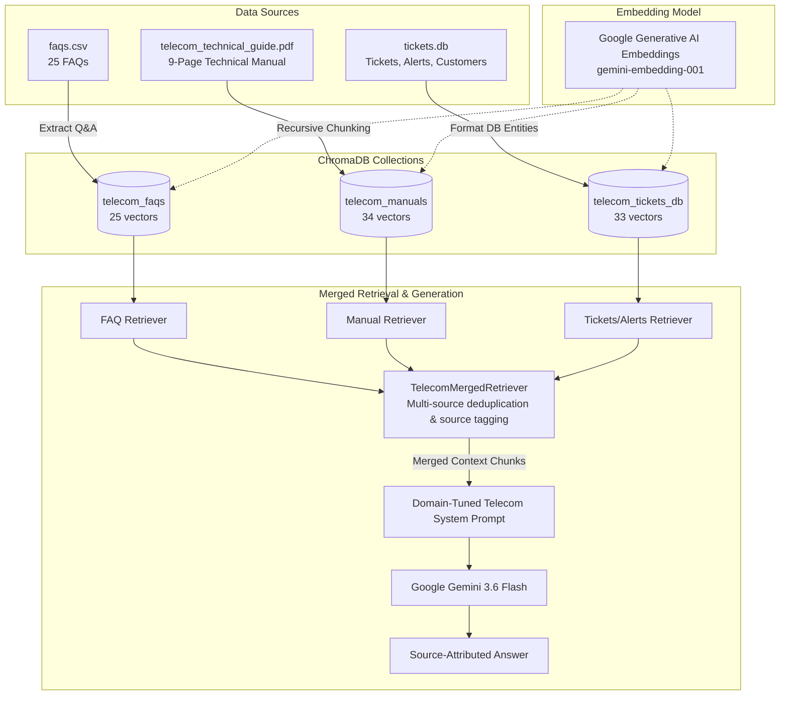

# Telecom RAG Chatbot

An enterprise-grade Retrieval-Augmented Generation (RAG) system for telecom technical support, operations, and customer care. Built using **Google Gemini** (Chat & Embeddings), **ChromaDB** (multi-collection vector storage), and **LangChain LCEL**, managed with the **`uv`** package manager.

---

## 🏛️ Architecture Overview

The system ingests 3 heterogeneous data sources into 3 isolated ChromaDB collections, then merges them dynamically at retrieval time to synthesize accurate, source-attributed responses.



---

## 📁 Project Structure

```
telecom RAG/
├── .env                      # API keys & model configuration
├── .gitignore                # Ignores .venv, chroma_db, and caches
├── pyproject.toml            # Project dependencies managed by uv
├── README.md                 # System documentation & usage guide
├── test_rag.py               # CLI benchmark test suite & interactive mode
├── data/                     # Source documents
│   ├── faqs.csv
│   ├── telecom_technical_guide.pdf
│   └── tickets.db
├── chroma_db/                # Persistent vector database collections
└── src/                      # Core modular implementation
    ├── __init__.py
    ├── config.py             # Configuration & environment variable validation
    ├── data_loader.py        # Custom parsers for CSV, PDF, and SQLite tables
    ├── ingestion.py          # Embedding & multi-collection ChromaDB ingestion
    ├── retriever.py          # TelecomMergedRetriever combining all 3 vectorstores
    └── rag_chain.py          # LangChain LCEL RAG pipeline & system prompt
```

---

## 🚀 Getting Started

### 1. Prerequisites
- Python 3.11+
- [uv](https://docs.astral.sh/uv/) package manager
- Google Gemini API key configured in `.env`

### 2. Environment Setup
The virtual environment and dependencies are managed via `uv`:
```bash
uv venv --python 3.12
uv sync
```

### 3. Interactive Terminal Chat (Ask Questions)
By default, running `test_rag.py` opens an interactive chat where you can ask any question:
```bash
uv run python test_rag.py
# Or explicitly:
uv run python test_rag.py --interactive
```

### 4. Ask a Single Question Directly
You can also pass your question directly as a command-line argument:
```bash
uv run python test_rag.py "How do I activate international roaming?"
uv run python test_rag.py "Are there any active cell tower outages in Northridge?"
```

### 5. Run Automated Benchmark Suite
To run the automated verification suite across all 3 domains:
```bash
uv run python test_rag.py --benchmark
```

### 6. Re-ingest Data (Optional)
To force-rebuild the ChromaDB vector database:
```bash
uv run python src/ingestion.py --force
# Or via test_rag:
uv run python test_rag.py --reingest
```

---

## 🔍 Multi-Collection Merged Retrieval Details

| Collection Name | Source File | Extracted Entities | Metadata Stored |
|---|---|---|---|
| `telecom_faqs` | `data/faqs.csv` | 25 Q&A pairs (Billing, Data, SIM, Roaming, Voice) | `faq_id`, `category`, `source_type="faq"` |
| `telecom_manuals` | `data/telecom_technical_guide.pdf` | 34 chunked sections (Network evolution, VoLTE, roaming architecture, diagnostics) | `page`, `source_type="manual"` |
| `telecom_tickets_db` | `data/tickets.db` | 23 support tickets, 3 active/scheduled service alerts, 7 customer accounts | `table`, `ticket_id`, `severity`, `category` |

The `TelecomMergedRetriever` dynamically gathers relevant documents across all three vector collections, eliminates content duplicates, and formats them into transparently labeled source blocks for the Google Gemini chat model.
