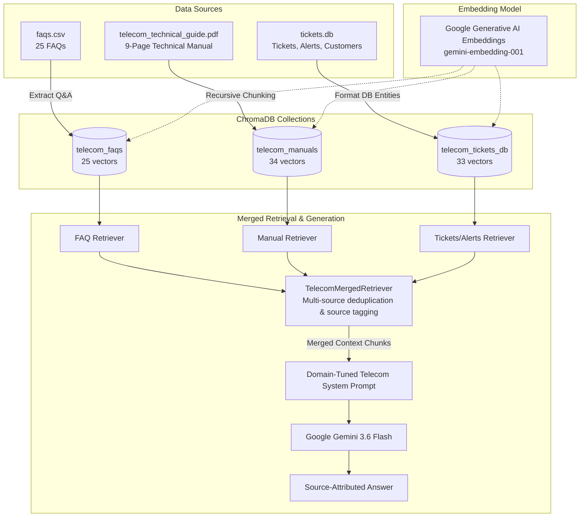

# Telecom RAG Chatbot

An enterprise-grade Retrieval-Augmented Generation (RAG) system for telecom technical support, operations, and customer care. Built using **Google Gemini** (Chat & Embeddings), **ChromaDB** (multi-collection vector storage), and **LangChain LCEL**, managed with the **`uv`** package manager.

---

## 🏛️ Architecture Overview

The system ingests 3 heterogeneous data sources into 3 isolated ChromaDB collections, then merges them dynamically at retrieval time to synthesize accurate, source-attributed responses.



---

## 📁 Project Structure

```
telecom RAG/
├── .env                      # API keys & model configuration (local, ignored by git)
├── .env.example              # Template environment configuration
├── .gitignore                # Excludes .venv, chroma_db, dist, caches
├── .vercelignore             # Build exclusion rules for Vercel deployment
├── AGENTS.md                 # Architecture decisions & development log
├── README.md                 # System documentation & usage guide
├── package.json              # Root build & dev scripts delegating to frontend
├── pyproject.toml            # Project dependencies & dev extras (managed by uv)
├── requirements.txt          # Serverless Python dependencies (single source of truth)
├── vercel.json               # Vercel fullstack build & SPA routing configuration
├── test_rag.py               # CLI benchmark test suite & interactive mode
├── uv.lock                   # Deterministic lockfile generated by uv
│
├── api/                      # Fullstack Serverless API Layer
│   └── index.py              # Lightweight FastAPI cosine-similarity RAG endpoint
│
├── data/                     # Source documents & pre-computed embeddings
│   ├── embedded_knowledge.json # Pre-computed 3072-dim embeddings for serverless
│   ├── faqs.csv              # 25 customer support FAQs
│   ├── telecom_technical_guide.pdf # 9-page technical manual
│   └── tickets.db            # SQLite operational database (tickets, alerts, accounts)
│
├── frontend/                 # React frontend application (Vite)
│   ├── index.html            # SPA HTML entry point
│   ├── package.json          # Frontend dependencies (React 19, Lucide, Vite)
│   ├── vite.config.js        # Vite dev server & proxy configuration
│   └── src/                  # React components & modern design system
│       ├── components/       # UI Components (Sidebar, ThemeToggle)
│       ├── App.jsx           # Main chat layout, history state & prompt feed
│       ├── api.js            # API client for /api/chat
│       └── index.css         # Design system & dark/light theme tokens
│
├── chroma_db/                # Persistent vector database collections (local development)
└── src/                      # Offline Data Ingestion & ChromaDB RAG Engine
    ├── __init__.py
    ├── config.py             # Configuration & environment variable validation
    ├── data_loader.py        # Dedicated parsers for CSV, PDF, and SQLite DB
    ├── ingestion.py          # Vector ingestion & JSON embedding exporter
    ├── retriever.py          # TelecomMergedRetriever combining collections
    └── rag_chain.py          # LangChain LCEL RAG pipeline & telecom prompt
```

---

## 🚀 Getting Started

### 1. Prerequisites
- Python 3.11+
- [uv](https://docs.astral.sh/uv/) package manager
- Google Gemini API key configured in `.env`

### 2. Environment Setup
The virtual environment and dependencies are managed via `uv`:
```bash
uv venv --python 3.12
uv sync --extra dev
```

### 3. Web Frontend (React + FastAPI)

The web UI provides a modern, interactive experience:
- **Direct Chat Landing**: Users land directly on the chat session with the input bar focused and active conversation restored.
- **Collapsible Sidebar**: Openable via the header button, featuring:
  - **Multi-Session History**: Auto-saves past conversations in browser `localStorage`, dynamic session titles, relative timestamps, and delete actions.
  - **Searchable FAQs Hub**: 18 categorized telecom FAQs with live search and category pills (*Roaming*, *Connectivity*, *SIM & Device*, *Billing*, *Data & Voice*). Clicking any question asks the assistant immediately.
- **Light & Dark Theme Switcher**: Toggle between midnight slate dark mode and clean light mode, with automatic system preference detection and persistence.

You can launch the web application in two steps:

**Step A: Start the FastAPI Backend API**
```bash
uv run uvicorn api.index:app --host 127.0.0.1 --port 8000
```

**Step B: Start the React Frontend**
```bash
npm run dev
```
Open **`http://localhost:5173`** in your browser.

**Build for Production:**
```bash
npm run build
```

**Deploying 100% on Vercel (Fullstack Frontend + Serverless API):**
This project supports fullstack deployment directly to Vercel with zero external servers:
1. **Push this repository to GitHub**.
2. **Import into Vercel**:
   - In Vercel, import your repository (`yogeshwaran-cse/RAG-based-telecom-chatbot`).
   - Keep the default Root Directory (`./`).
   - Vercel automatically uses `vercel.json` to build the React frontend and deploy `api/index.py` as a serverless function.
3. **Set Environment Variable in Vercel**:
   - Go to **Project Settings** > **Environment Variables**.
   - Add:
     - `GEMINI_API_KEY`: *(your Google Gemini API key)*
4. **Deploy**:
   - Click **Deploy** (or Redeploy).
   - Your frontend and backend are both live on the same domain with no CORS or external server required!

### 4. Interactive Terminal Chat (Ask Questions)
By default, running `test_rag.py` opens an interactive CLI where you can ask any question:
```bash
uv run --extra dev python test_rag.py
```

### 5. Ask a Single Question Directly
You can also pass your question directly as a command-line argument:
```bash
uv run --extra dev python test_rag.py "How do I activate international roaming?"
uv run --extra dev python test_rag.py "Are there any active cell tower outages in Northridge?"
```

### 6. Run Automated Benchmark Suite
To run the automated verification suite across all 3 domains:
```bash
uv run --extra dev python test_rag.py --benchmark
```

### 7. Re-ingest & Export Data (Optional)
To force-rebuild the ChromaDB vector database and re-export `data/embedded_knowledge.json`:
```bash
uv run --extra dev python src/ingestion.py --force --export
# Or re-ingest ChromaDB via test_rag:
uv run --extra dev python test_rag.py --reingest
```

---

## 🔍 Multi-Collection Merged Retrieval Details

| Collection Name | Source File | Extracted Entities | Metadata Stored |
|---|---|---|---|
| `telecom_faqs` | `data/faqs.csv` | 25 Q&A pairs (Billing, Data, SIM, Roaming, Voice) | `faq_id`, `category`, `source_type="faq"` |
| `telecom_manuals` | `data/telecom_technical_guide.pdf` | 34 chunked sections (Network evolution, VoLTE, roaming architecture, diagnostics) | `page`, `source_type="manual"` |
| `telecom_tickets_db` | `data/tickets.db` | 23 support tickets, 3 active/scheduled service alerts, 7 customer accounts | `table`, `ticket_id`, `severity`, `category` |

The `TelecomMergedRetriever` dynamically gathers relevant documents across all three vector collections, eliminates content duplicates, and formats them into transparently labeled source blocks for the Google Gemini chat model.

---

## 🙏 Acknowledgements & Credits

Special thanks to **[Codebasics](https://codebasics.io/)** for providing the telecom support dataset (`faqs.csv`, `telecom_technical_guide.pdf`, and `tickets.db`) used to build this project as part of their **[Agentic AI Crash Course](https://codebasics.io/resources/agentic-ai-crash-course)**.
